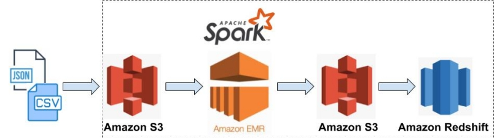
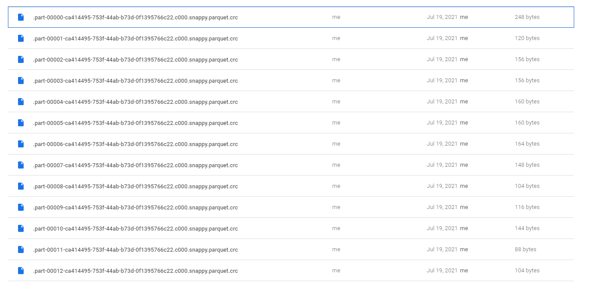
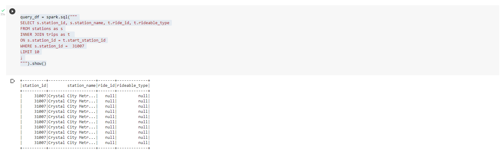
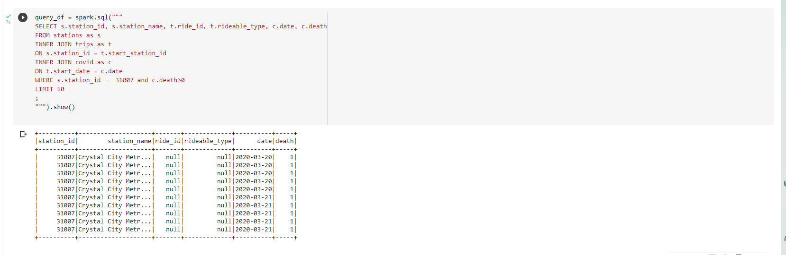

### Udacity Data Engineering Nanodegree
#Project 6: Capstone Project 

##### &nbsp;

## Introduction
[Capital Bikeshare](https://www.capitalbikeshare.com/) is a Washington DC based bicycle-sharing system which has 4300+ bikes at 500 stations across 7 areas: Arlington, VA; Alexandria, VA; Montgomery County, MD; Prince George's County, MD; Fairfax County, VA; and the City of Falls Church. The company provides accessible and affordable transportation options for anyone in those areas, without any concern for income. 

Since 2018, the company has been sharing its monthly trip data in Amazon S3 Bucket, although we can retrieve the yearly data up until 2010. Designed for quick trips with convenience in mind, it’s a fun and affordable way to get around.
Their equity program allows those who qualify for certain state or federal assistance programs to sign up individually, in addition to being able to join through a Community Partner.

##### &nbsp;
## Goal

The goal of this project is to create an ETL pipeline that extracts data from S3, stages and processes them using Apache Spark, and transforms data into a set of dimensional tables and loads them back to S3 for the analytics team to continue finding insights in trips, weather and covid-19 data. As the service is growing steadily, the analytics team wants to leverage its data to create a data driven decision making process. The team also wants to integrate weather data and covid-19 related data with the trips data, both of which are publicly available. They are interested in answering questions such as a) What is the most popular destination? b) What date and time is the most popular? c) How does covid-19 impacts the business? d) does weather have an impact on the bike rentals? e) Is there any gap between the demand and supply in any of the seven locations and so on. However, within the current setup it is difficult to make sense of the data. 

##### &nbsp;
## Project Scope

### Datasets
For this project, you'll be working with three datasets: 

#### Captial Bikeshare trip data

Capital Bikeshare provides all the [trip data](https://s3.amazonaws.com/capitalbikeshare-data/index.html) in **CSV** format. 
Total number of records up until May 2001: ** 29,019,867**

#### Covid data

The [COVID Tracking project](https://covidtracking.com/) collects, cross-checks, and publishes COVID-19 data from 56 US states and territories in four main areas: Federal COVID data, Nursing Homes & Long Term Care Data, Race & COVID, Vaccination Data. 

The capstone project uses `Historic values for all states` **JSON** data downloaded from the [data API](https://covidtracking.com/data/api).Descriptions of the data fields can also be found there. The COVID Tracking Project has ended all data collection as of March 7, 2021. 

Total number of records: **20,780**

#### Weather data

The weather data is from [NOAA](https://www.ncdc.noaa.gov/cdo-web/). The 
daily observation data has from more than 100 weather stations in 
Washington DC since January, 2018. The data is in **CSV** format. 

Total number of records: **128,579**

##### &nbsp;
## Schema Design 

We have designed the following Star Schema after analyzing trips data, weather data and covid data. The trip data is the core of the business; that is why we have decided the trip table as our fact table. Two of the dimension tables of this schema: covid table and weather table, can provide us critical information which acounts for the daily fluctuation of the business either based on weather or covid pandemic. The final dimension table: station table could also help to determine which station has the most potential to grow. 


### Fact table

|Field Name|Description|
|---|---|
|ride_id|Ride ID (available from May 2005)|
|rideable_type|Rideable type (available after May 2005)|
|started_at|Start time of the trip|
|ended_at|End time of the trip|
|start_station_id|Start station ID|
|end_station_id|End station ID|
|member_casual|Customer type (member or casual)|
|tid|Unique trip ID|
|start_date|Start date of the trip|


### Dimension tables

#### Station table

|Field Name|Description|
|---|---|
|station_id|Station ID|
|station_name|Station name (address)|

#### Covid table

|Field Name|Description|
|---|---|
|date|Date on which data was collected by The COVID Tracking Project|
|deathIncrease|Daily increase in death, calculated from the previous day’s value|
|hospitalizedCurrently|Individuals who are currently hospitalized with COVID-19|
|positive|Total number of confirmed plus probable cases of COVID-19 reported by the state or territory|
|positiveIncrease|The daily increase in API field positive, which measures Cases (confirmed plus probable) calculated based on the previous day’s value|
|recovered|Total number of people that are identified as recovered from COVID-19|

#### Weather table

|Field Name|Description|
|---|---|
|DATE|Date of the record|
|AWND|Average daily wind speed (meters per second)|
|TAVG|Average of hourly values|
|TMAX|Highest hourly temperature|
|TMIN|Lowest hourly temperature|
|WT01|Fog, ice fog, or freezing fog (may include heavy fog)|
|WT02|Heavy fog or heaving freezing fog (not always distinguished from fog)|
|WT03|Thunder|
|WT04|Ice pellets, sleet, snow pellets, or small hail|
|WT05|Hail (may include small hail)|
|WT06|Glaze or rime|
|WT08|Smoke or haze|
|WT11|High or damaging winds|


##### &nbsp;


## Project Structure
* **etl.py**: The script reads trips data, covid data and weather data from S3, transforms them to create five different tables, and writes them to partitioned parquet files in table directories on S3.
* **sql_queris.py**: The script captures the column names as per star-schema design.
* **dl.cfg**: Contains credentials for accessing S3 and creating Amazon redshift cluster 
* **Nanodegree_Capstone_Project.ipynb**: Notebook for trying things out locally before putting them into a script.
* **redshift_database_creation.py**: This script creates redshift cluster, database and after processing everything deletes the resources 
* **data**: A sample of trips data and weather data saved locally for testing before going to S3.
* **images**: Images used for this readme file

##### &nbsp;

We have multiple options to create Data Lakes in AWS. We have to decide: 
a)Type of Storage b) the processing engine and c) AWS-Managed solution or a Vendor managed solution.

In this project, we will be using : **Processing Engine: Apache Spark, Managed solution: Amazon EMR, and Storage Type: S3.** Here is a depiction of the options:  



* **Lake Storage**: S3
* **Lake Processing**: Spark 

## Explore and access the data
There is a jupyter notebook which can be run using google colab that has the EDA of the dataset 
[Nanodegree_Capstone_Project.ipynb](Nanodegree_Capstone_Project.ipynb).

## How to run the project

#### Create a EC2 key pair

```sh
# Set the permission of the private key file.
chmod 400 <path/to/the/pem/file>
```

#### Create default roles in IAM.
```sh
aws emr create-default-roles
```


#### Start an EMR cluster 
```sh
# create a default subnet which is required to run the EMR notebook (optional)
aws ec2 create-default-subnet --availability-zone <your zone name>

# create the EMR cluster
# Caveat: Kernel error occurs when using Jupyter notebook with emr-5.32.0!
aws emr create-cluster --release-label emr-5.29.0 \
                       --instance-type m5.xlarge \
                       --instance-count 3 \
                       --name data-lake-emr \
                       --use-default-roles \
                       --applications Name=Spark Name=Livy \
                       --ec2-attributes SubnetId=<your subnet Id name>,KeyName=<your permission key name>

# optional
aws emr describe-cluster --cluster-id <ClusterId>
```

#### Modify the security group

This step is required for only once and can be skipped next time!.

Caveat: Your IP address could vary from time to time!

```sh
# Show EMR security group names and IDs.
aws ec2 describe-security-groups --filters Name=group-name,Values="ElasticMapReduce-*" \
                                 --query "SecurityGroups[*].{Name:GroupName,ID:GroupId}"

# Allow connect to the master node via ssh. 
aws ec2 authorize-security-group-ingress --group-id <ElasticMapReduce-master ID> \
                                         --protocol tcp \
                                         --port 22 \
                                         --cidr <IP address>/24

# Show details of the modified security group.
aws ec2 describe-security-groups --group-ids <ElasticMapReduce-master ID>
```

One can find the IP address at https://checkip.amazonaws.com/

#### Establish ssh connection to the master node

```sh
# Verify that you can ssh to the master node.
ssh -i <path/to/the/pem/file> hadoop@<MasterPublicDnsName>

# Open a SSH tunnel with port:
# - 18080: Spark history server
# -  8088: YARN ResourceManager
# - 50070: Hadoop file system
ssh -i <path/to/the/pem/file> -N -L 8157:<MasterPublicDnsName>:<port> hadoop@<MasterPublicDnsName>
```

Open a local browser and go to http://localhost:8157


#### Run the ETL pipeline

```sh
# Copy the file to the cluster.
scp -i <path/to/the/pem/file> etl.py hadoop@<MasterPublicDnsName>:~/

# Set Pyspark Python version
sudo sed -i -e '$a\export PYSPARK_PYTHON=/usr/bin/python3' /etc/spark/conf/spark-env.sh

# Run the pipeline.
ssh -i <path/to/the/pem/file> hadoop@<MasterPublicDnsName>
spark-submit etl.py
```

#### Start an AWS Redshift cluster and create tables

```sh
python redshift/start_db_on_redshift.py
```

Once you are done with the process, don't forget to delete your resources! 

#### Terminate the EMR cluster
```sh
aws emr list-clusters --active
aws emr terminate-clusters --cluster-ids <ClusterId>
```

##### &nbsp;


## Results 
If everything goes smooth, you should have .parquet files like these: 



##### &nbsp;

## Sample Queries 

Here is one of the sample queries:

* **Query one**


* **Query two**



## Running the project in Google Colab for testing
If you want to run the project in a local server, which is highly recommended as becasue it is rather difficult and time consuming to debug pyspark errors, there is a jupyter notebook included in this project [Apache Spark in Google Colab](Nanodegree_Capstone_Project.ipynb). This notebook includes all necessary information to setup and run Apache Spark in colab along with the project implementation. This is a free cloud service, which makes it easier to try and debug with smaller subset of the data

## Addressing Other Scenarios

- *What if the data was increased by 100x?*

The data size of all files are more than 1.5 GB. If we increase the size by 100 times, the size would be 150 GB. However, Redshift allows to run complex analytic queries against terabytes to petabytes of structured and 
semi-structured data. For more details, please check https://aws.amazon.com/redshift/faqs/.

- *What if the data populates a dashboard that must be updated on a daily basis 
  by 7am every day?*
  
We can create Apache airflow schedule to update data on a daily basis. 

- *What if the database needed to be accessed by 100+ people?*

Amazon Redshift allows a max of 500 connections and 50 concurrencies per cluster. For more details, please check: 
https://docs.aws.amazon.com/redshift/latest/mgmt/amazon-redshift-limits.html.

We can think of another way to accommodate 100+ concurrent access. If users do not need to perform insert and update, plus they only require to access queries, then NoSQL database is another option like Cassandra 


